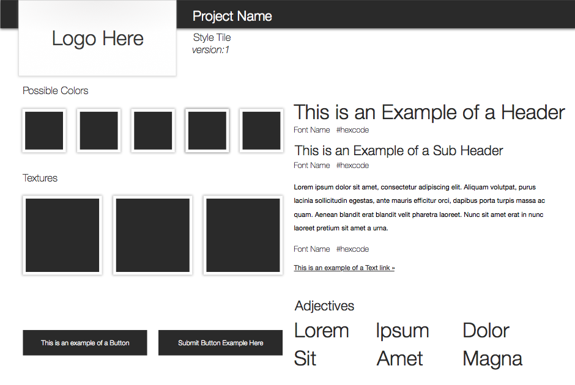

#Style Tiles
####A visual web design process *for* clients *&* the responsive web
**Original work by [@samanthatoy](http://twitter.com/intent/user?screen_name=samanthatoy)**
> [Style Tiles](http://styletil.es/) are a design deliverable consisting of fonts, colors and interface elements that communicate the essence of a visual brand for the web.

##Example

##Current formats
- .psd (original, Adobe Photoshop)
- .sketch (self explanatory, but used with Sketch)
- .xcf (used by GIMP)

*If you want any particular format, change or fix, submit an issue or better yet a pull request.*

##Modifications
- Typography: wasn't sure what font was used, so I just used Helvetica Neue.
- Color: used #2A2A2A instead of #000

##Disclaimer
This repo is not be endorsed by @samanthatoy, I just liked the strategy/method but wished it were available on more than just Adobe Photoshop.

##License
StyleTil.es is licensed under a [Creative Commons Attribution-NonCommercial 3.0 Unported License](http://creativecommons.org/licenses/by-nc/3.0/)
